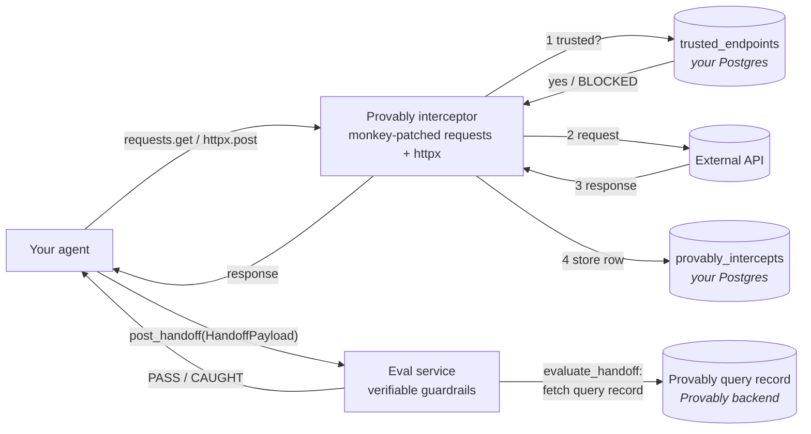

# Verifiable Data AgentKit

[](CHANGELOG.md)
[](pyproject.toml)
[](LICENSE.md)

The Python SDK for [Provably](https://provably.ai). Adds a deterministic
**eval** layer (verifiable guardrails — distinct from proof _verification_)
to any Python agent: every outbound HTTP call is recorded, every claim
handed off to another agent is evaluated against a trusted Provably query
record, and the policy edge — which endpoints an agent is allowed to talk
to at all — is enforced before the request leaves the process.

- **Distribution name:** `provably-sdk` (PyPI publish pending — see below)
- **Import name:** `provably`
- **Source layout:** `src/provably/`

## Contents

- [What it does](#what-it-does)
- [Framework coverage](#framework-coverage)
- [Install](#install)
- [Quick start](#quick-start)
- [Configuration](#configuration)
- [The five pillars](#the-five-pillars)
  - [`init`](#init)
  - [`intercept`](#intercept)
  - [`handoff`](#handoff)
  - [`eval`](#eval)
  - [`trusted_endpoints`](#trusted_endpoints)
- [Public API](#public-api)
- [Development](#development)
- [Tests](#tests)
- [Docker](#docker)
- [Security model](#security-model)
- [Status](#status)

## What it does



The flow, in order:

1. **Intercept + Police** — every outbound `requests` / `httpx` / `aiohttp`
   call goes through the SDK's monkey-patched HTTP path. _Inside_ the interceptor, before
   the request leaves the process, the URL is checked against the
   `trusted_endpoints` table. If the URL is not registered the call is killed
   with `RuntimeError("BLOCKED: ...")` and never reaches the network.
2. **Capture + Store** — if the endpoint is trusted, the request goes out, the
   response is captured (status + headers + raw body), canonicalized, and
   inserted by the interceptor into `provably_intercepts`. The agent only
   sees the response after the row is written.
3. **Hand off** — when an agent finishes its work it builds a typed
   `HandoffPayload` (one `HandoffClaim` per external call, describing what the
   agent claims about that response) and ships it to the next agent / service
   via `post_handoff(...)`.
4. **Eval** — the receiving service runs `evaluate_handoff(payload)` (the
   SDK's verifiable-guardrails check; **not** to be confused with proof
   verification). For each claim the evaluator pulls the corresponding query
   record from the Provably backend and runs one of four deterministic
   comparisons (`verbatim`, `field_extraction`, `schema_type`,
   `range_threshold`); the result is `PASS`, `CAUGHT`, or `ERROR` per claim.

Nothing in this loop relies on a model self-evaluating its own output.

### Where things live

| Component | Hosted by | Notes |
| --- | --- | --- |
| `trusted_endpoints` table | **You** — sits in whatever Postgres `POSTGRES_URL` points to. | The SDK ships the schema (`ensure_trusted_endpoints_table`), the policy check, and CRUD helpers; it does **not** host the registry. Same DB instance as `provably_intercepts`. |
| `provably_intercepts` table | **You** — same Postgres as above. | Append-only. The interceptor inserts one row per outbound HTTP call, keyed by `query_record_id` so claims can be linked back. |
| Eval service | **You** — any HTTP service that calls `provably.evaluate_handoff(...)` on the incoming payload. | The SDK gives you the function; you decide where to host it. |
| Provably query record | **Provably** — fetched over HTTPS by the eval service using the `integration_api_key` from the handoff payload. | This is the source of truth the evaluator compares each claim against. |

## Framework coverage

The interceptor patches the central HTTP transport choke points, so coverage of
agent frameworks follows automatically from which library a framework uses
under the hood. As of v0.3.0:

**Transport patches**

| Transport | Patched at |
| --- | --- |
| `requests` | module-level `get`/`post` + `Session.send` |
| `httpx` | module-level `get`/`post` + `Client.send` + `AsyncClient.send` |
| `aiohttp` | `ClientSession._request` (soft dep — patches only when `aiohttp` is importable) |
| `botocore` / `urllib3` | _pending_ — see [issue #10](https://github.com/ProvablyAI/provably-python-sdk/issues/10) |

**Agent / LLM frameworks**

| Framework | Status | Notes |
| --- | --- | --- |
| OpenAI SDK | ✅ | httpx |
| Anthropic SDK | ✅ | httpx |
| Pydantic AI | ✅ | delegates to AsyncOpenAI / AsyncAnthropic |
| LangChain | ✅ | delegates to provider SDKs |
| LangGraph | ✅ | same |
| LlamaIndex | ✅ | httpx via OpenAI SDK |
| AutoGen | ✅ | AsyncOpenAI |
| Haystack | ✅ | migrated to httpx (2024–25) |
| Phidata / Agno | ✅ | AsyncOpenAI / `httpx[http2]` |
| OpenAI Agents SDK | ✅ | httpx; e2e suite at [tests/e2e/test_openai_agents_e2e.py](tests/e2e/test_openai_agents_e2e.py); demo at [examples/openai_agents/](examples/openai_agents/) |
| Google GenAI | ✅ | httpx default + optional `aiohttp` extra |
| LiteLLM | ✅ | aiohttp transport (default since v1.71) |
| DSPy | ✅ | LiteLLM only |
| smolagents | ✅ | OpenAI SDK / HF / LiteLLM paths covered |
| CrewAI | ⚠️ | OpenAI/Anthropic ✅, LiteLLM fallback ✅, **Bedrock provider ❌** (boto3) |
| AWS Strands | ❌ | boto3/botocore → urllib3; tracked in [issue #10](https://github.com/ProvablyAI/provably-python-sdk/issues/10) |

**Out of scope for the HTTP interception layer** (separate shipping units):
MCP servers, in-process LLMs (`transformers`, `mlx_lm`), gRPC (Google ADK
A2A), websockets, raw sockets.

## Install

> **Status:** v0.2 — not yet published to PyPI. Install from source.

```bash
# from source (editable, recommended for now)
git clone git@github.com:ProvablyAI/provably-python-sdk.git
pip install -e ./provably-python-sdk

# or build a wheel
cd provably-python-sdk && python -m build
pip install dist/provably_sdk-0.2.0-py3-none-any.whl
```

When PyPI publishing lands the install will become:

```bash
pip install provably-sdk
```

The intended PyPI distribution name is `provably-sdk`. The import name is
`provably`. Requires Python 3.11+.

## Quick start

```python
import provably
import requests

# One-call bootstrap: initialize runtime + install interceptor + enable recording
provably.configure_indexing(True)

response = requests.get("https://my-trusted-endpoint.example/data")
record = response.json()

payload = provably.HandoffPayload(
    provably_org_id="my-org",
    integration_api_key="...",
    task="discharge_summary",
    claims=[
        provably.HandoffClaim(
            action_name="lookup_patient",
            claimed_value=record,
            query_record_id="qr_123",
        ),
    ],
)
provably.post_handoff("https://my-eval-service.example", payload)
```

On the eval-service side:

```python
import provably

result = provably.evaluate_handoff(
    payload,
    provably_base_url="https://api.provably.ai",
)
# outcome is "PASS", "CAUGHT", or "ERROR"
assert result["outcome"] in ("PASS", "CAUGHT", "ERROR")
```

## Configuration

The SDK reads configuration from environment variables. A typed
`Provably(api_key=..., org_id=..., ...)` client that replaces these globals is
planned (issue [#2](https://github.com/ProvablyAI/provably-python-sdk/issues/2)).

#### Getting `PROVABLY_API_KEY` and `PROVABLY_ORG_ID`

1. Sign up at [app.provably.ai](https://app.provably.ai).
2. Create an organisation. Its id is what goes in `PROVABLY_ORG_ID`.
3. In the left-side menu, go to **Integrations** and create one. The generated key is your `PROVABLY_API_KEY`.

Full product docs: [provably.ai/docs](https://provably.ai/docs).

| Variable | Used by | Required |
|---|---|---|
| `PROVABLY_API_KEY` | `initialize_runtime`, integration cache | yes |
| `PROVABLY_ORG_ID` | `initialize_runtime`, intercept allow-list | yes |
| `PROVABLY_RUST_BE_URL` | `initialize_runtime`, evaluator | yes |
| `POSTGRES_URL` | intercept storage, trusted endpoints, handoff preprocess | yes |
| `PROVABLY_APP_UI_URL` | optional UI deep-links | no |
| `PROVABLY_QUERY_RESOLVE_MAX_WAIT_S` | max seconds to wait for a query record to appear (default 15) | no |

`POSTGRES_URL` is a hard dependency today. Three SDK modules open Postgres
directly (`provably.intercept._storage`, `provably.trusted_endpoints`,
`provably.handoff._preprocess`). Issue
[#1](https://github.com/ProvablyAI/provably-python-sdk/issues/1) tracks moving
them onto a caller-injected connection and making `psycopg2-binary` optional.

## The five pillars

### `init`

```python
import provably

# Option A: one-call bootstrap (recommended)
provably.configure_indexing(True)   # bootstrap + interceptor + enable
provably.configure_indexing(False)  # interceptor only, recording off

# Option B: step-by-step
provably.initialize_runtime()   # one-time bootstrap; idempotent per process
provably.init_interceptor()     # install monkey-patches for requests + httpx
provably.enable()               # turn recording on (default after init_interceptor)
```

`initialize_runtime()` registers a Provably middleware, onboards the configured
Postgres database, ensures the `provably_intercepts` collection exists, and
warms an in-memory cache with the integration API key.

`configure_indexing(enable_indexing)` is the recommended single-call entry point.
Pass `True` to enable full indexing (bootstrap + intercept + record); pass `False`
to install the interceptor in passthrough mode (patches installed, recording off).

### `intercept`

```python
provably.enable()                   # default after init_interceptor()
provably.disable()                  # stop recording (patch stays installed)
provably.is_enabled()               # bool

provably.set_interceptor_context(   # tag the next intercept rows
    agent_id="cluster_a",
    action_name="lookup_patient",
    intercept_index=0,
)

provably.set_intercept_body_hook(   # optional: (intercept_index, raw) -> what the caller sees
    lambda _idx, raw: {"user_edited": True},
)

provably.set_intercept_url_allowlist(   # scope simulation hook to specific URLs
    ["https://my-trusted-api.example/v1"],
)
```

The interceptor records every successful `requests.get/post` and `httpx.get/post`
into `provably_intercepts`. The original wire response is stored first; the hook
only affects the object returned to application code, not the stored row.

`set_intercept_url_allowlist` scopes the simulation body hook to an explicit set
of URLs. Internal SDK calls (bootstrap API, handoff transport) are never passed
to the hook regardless of this setting.

> ⚠ The interceptor monkey-patches the global `requests` and `httpx` modules.
> This is intentional — every consumer in the process gets observed
> automatically — but it means hosts that need a request-scoped opt-out should
> wrap calls in `disable()` / `enable()` blocks.

### `handoff`

```python
from provably import HandoffPayload, HandoffClaim, post_handoff

payload = HandoffPayload(
    provably_org_id="my-org",
    integration_api_key="key",
    claims=[HandoffClaim(action_name="get", claimed_value=..., query_record_id="qr_1")],
)
post_handoff("https://my-eval-service.example", payload, headers={"x-trace-id": "abc"})
```

`post_handoff` POSTs canonical JSON to `{base_url}/handoffs/receive` and raises
on any non-2xx response.

#### Convenience builders

`build_handoff_payload` assembles a `HandoffPayload` automatically from the
interceptor's in-memory state — no manual claim construction needed:

```python
from provably import build_handoff_payload, post_handoff

# fetch_and_claim is the raw JSON dict the LLM emitted
payload = build_handoff_payload(fetch_and_claim, run_id="run-001")
post_handoff("https://your-verifier.example.com", payload)
```

`claim_contract` generates the system-prompt text that tells an LLM how to
emit the correct `HandoffClaim` JSON shape:

```python
from provably import claim_contract

system_prompt = claim_contract(
    action_names=["lookup_patient", "fetch_records"],
    wrapper_fields={"reasoning": "string"},
)
```

`default_instructions` and `field_descriptions` give you ready-made
instructions and per-field notes to embed in a receiving-agent prompt:

```python
from provably import default_instructions, field_descriptions

# provably_indexing=True when you want the receiver to call the evaluator
instructions = default_instructions(provably_indexing=True)
guide = field_descriptions(provably_indexing=True)
```

### `eval`

```python
from provably import evaluate_handoff

result = evaluate_handoff(payload, provably_base_url="https://api.provably.ai")
# {"outcome": "PASS" | "CAUGHT" | "ERROR", "per_claim": [...], "errors": [...]}
```

Outcome semantics:

- **`PASS`** — every claim's content matched its proven indexed value and every proof verified.
- **`CAUGHT`** — at least one claim disagreed with the indexed value or a proof failed.
- **`ERROR`** — the evaluator could not run (missing config, Provably backend unreachable, transient server error). Not evidence of tampering — the system was unhealthy, not the agent.

#### Getting `CAUGHT` and you don't expect to be?

`CAUGHT` means the indexed value the evaluator pulled from `provably_intercepts` doesn't match the claim. In practice when this surprises you, it's almost always one of:

1. **The tool body never ran.** `@function_tool` (or any agent-framework decorator) only registers the function — you still need an agent loop (e.g. `Runner.run(...)`) to invoke it. Bare LLM calls don't execute tools.
2. **`intercept_context(...)` was called without `with`.** It's a context manager; a bare call is a no-op (see the function's docstring).
3. **`agent_id` mismatch.** The `agent_id` you pass to `intercept_context(...)` inside the tool must match the `intercept_agent_id` you pass to `build_handoff_payload(...)` (default `"fetch_and_claim"`). Mismatch → the lookup misses → empty `request_payload`.
4. **Wrong row-id helper.** Use `get_intercept_row_id(agent_id, action_name)` to pick the row tagged with your action. `take_last_intercept_row_id()` returns the **globally** last insert (typically the final LLM POST), which is rarely what you want.

Comparison modes (the `VerificationMode` type):

| Mode | Comparison |
|---|---|
| `verbatim` | Canonical-JSON equality between `claimed_value` and the indexed payload (or `json_path` slice). |
| `field_extraction` | Equality on the value at `json_path` only. |
| `schema_type` | `claimed_value` is ignored; the value at `json_path` is validated against `expected_json_schema`. |
| `range_threshold` | Numeric `claimed_value` must equal the indexed numeric and lie in `[range_min, range_max]`. |

#### Outcome helpers

```python
from provably import outcome_from_trace, aggregate_outcome

# Extract verdict from a raw evaluate_handoff result dict
verdict = outcome_from_trace(result)   # "PASS" | "CAUGHT" | None

# Roll up verification_results from a HandoffPayload
verdict = aggregate_outcome(payload)   # "PASS" | "CAUGHT"
```

### `trusted_endpoints`

```python
import psycopg2
from provably import (
    is_trusted_endpoint,
    list_trusted_endpoints,
    normalize_url_for_trust,
    ensure_trusted_endpoints_table,
)

conn = psycopg2.connect("...")
ensure_trusted_endpoints_table(conn)
ok = is_trusted_endpoint("https://api.example.com/v1/data", "my-org", conn)
rows = list_trusted_endpoints(conn, "my-org")
```

The registry is a single Postgres table (DDL embedded; created on first use).
URLs are normalized (lowercase scheme + host, default ports collapsed, trailing
slash dropped) before any read or write so that `https://API.EXAMPLE.COM/x/`
and `https://api.example.com/x` collide on the same row.

#### Path-pattern entries

Concrete URLs match exactly. To authorize a family of URLs with a single entry —
useful for templated routes like `/customers/{id}` or runtime-generated ids —
register the URL with FastAPI/Express-style placeholders:

| Placeholder | Matches | Example |
|---|---|---|
| `{name}` | exactly one path segment (no `/`) | `https://api.example.com/customers/{id}` matches `…/customers/42` but **not** `…/customers/42/orders` |
| `{name:path}` | any subtree (including `/` separators) | `https://api.example.com/customers/{rest:path}` matches both `…/customers/42` and `…/customers/42/orders` |

The placeholder name (`id`, `rest`, …) is purely descriptive and does not affect
matching. Plain URLs without `{` characters keep exact-match semantics — no
behavior change for existing entries.

```sql
-- Register a templated route once instead of enumerating every concrete id
INSERT INTO trusted_endpoints (org_id, normalized_url, display_label, entry_type)
VALUES ('my-org', 'https://api.example.com/customers/{id}', 'Customers (by id)', 'endpoint');
```

`is_trusted_endpoint` and the snapshot tamper-check inside `evaluate_handoff`
both honor the same matching rules, so a claim against `…/customers/42` will
pass both gates when only the templated entry is registered.

## Public API

All public symbols are re-exported from the top-level `provably` namespace. See
[`src/provably/__init__.py`](src/provably/__init__.py) for the full list.

```python
from provably import (
    # init
    initialize_runtime,
    configure_indexing,
    # intercept
    init_interceptor, enable, disable, is_enabled,
    set_interceptor_context, set_intercept_body_hook,
    set_intercept_url_allowlist, take_last_intercept_row_id,
    # handoff types
    HandoffPayload, HandoffClaim, HandoffProofAction, HandoffProofBundle,
    BenchmarkRow, Outcome, VerificationMode,
    # handoff transport
    post_handoff,
    # handoff builders
    build_handoff_payload, DEFAULT_HANDOFF_TASK,
    claim_contract, default_instructions, field_descriptions,
    # eval
    evaluate_handoff, extract_indexed_from_query_record,
    outcome_from_trace, aggregate_outcome,
    # trusted endpoints
    is_trusted_endpoint, list_trusted_endpoints,
    check_claim_endpoints_are_trusted, normalize_url_for_trust,
    ensure_trusted_endpoints_table,
)
```

## Development

```bash
git clone git@github.com:ProvablyAI/provably-python-sdk.git
cd provably-python-sdk
uv sync --extra dev
```

```bash
uv run ruff check .
uv run pytest
python -m build              # wheel + sdist into ./dist/
```

The SDK has no `fastapi`, `langgraph`, or LLM-vendor dependencies, and CI
should keep it that way — see [`docs/architecture.md`](docs/architecture.md)
for the dependency rules.

## Tests

The suite is split into two layers:

```
tests/
  unit/    # fast, hermetic, mocks for httpx + psycopg2
  e2e/     # drives real requests + httpx against a loopback HTTP server
```

```bash
uv run pytest tests/unit       # ~0.2 s
uv run pytest tests/e2e        # ~5 s (real http.server on a loopback port)
uv run pytest                  # both
uv run pytest -m "not e2e"     # unit-equivalent inner loop
```

E2E tests register routes on a per-test `FakeHttpServer` and drive the real
`requests` / `httpx` patches against it. The Postgres-touching storage layer
is patched per-test, so the suite stays hermetic and runs without a live
database.

## Docker

The repo ships a multi-stage `Dockerfile`. Three build targets are exposed:

| Target    | What it produces                                                    |
| --------- | ------------------------------------------------------------------- |
| `builder` | Wheel + sdist in `/dist` (used by the other stages, not run alone). |
| `test`    | Wheel installed + dev tools; `CMD` runs `ruff check && pytest -q`.  |
| `runtime` | Slim image with only the wheel; `CMD` smoke-imports `provably`.     |

Run the full lint + test suite in a container:

```bash
docker build --target test -t provably-sdk:test .
docker run --rm provably-sdk:test
```

Smoke-import the runtime image:

```bash
docker build --target runtime -t provably-sdk:runtime .
docker run --rm provably-sdk:runtime
```

Use `docker-compose.yml` for local development runs (no database required —
tests are hermetic):

```bash
docker compose run --rm sdk                  # ruff + pytest
docker compose run --rm sdk pytest -q -m e2e # only e2e tests
```

## Security model

- The interceptor monkey-patches the global `requests.get/post` and
  `httpx.get/post`. Hosts in process control are observed automatically; subprocesses
  and other languages are not.
- Trusted-endpoint enforcement happens **before** any row is inserted into
  `provably_intercepts`. A `GET` to an unlisted URL raises
  `RuntimeError("BLOCKED: ...")` and never reaches Postgres.
- The evaluator pulls query records over HTTPS using `x-api-key` from the
  payload's `integration_api_key`. Revoking that key revokes eval access
  for all in-flight handoffs.

## Status

v0.2 — see [`CHANGELOG.md`](CHANGELOG.md). License: Proprietary —
see [`LICENSE.md`](LICENSE.md).
