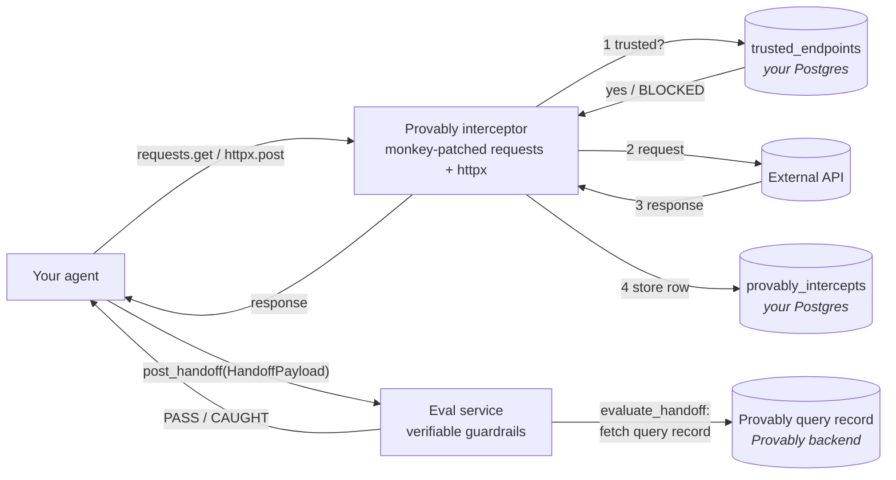

# provably-sdk

[](CHANGELOG.md)
[](pyproject.toml)
[](LICENSE.md)

The Python SDK for [Provably](https://provably.ai). Adds a deterministic
**eval** layer (verifiable guardrails — distinct from proof _verification_)
to any Python agent: every outbound HTTP call is recorded, every claim
handed off to another agent is evaluated against a trusted Provably query
record, and the policy edge — which endpoints an agent is allowed to talk
to at all — is enforced before the request leaves the process.

- **Distribution name:** `provably-sdk` (PyPI publish pending — see below)
- **Import name:** `provably`
- **Source layout:** `src/provably/`

## Contents

- [What it does](#what-it-does)
- [Install](#install)
- [Quick start](#quick-start)
- [Configuration](#configuration)
- [The five pillars](#the-five-pillars)
  - [`init`](#init)
  - [`intercept`](#intercept)
  - [`handoff`](#handoff)
  - [`eval`](#eval)
  - [`trusted_endpoints`](#trusted_endpoints)
- [Public API](#public-api)
- [Development](#development)
- [Tests](#tests)
- [Docker](#docker)
- [Security model](#security-model)
- [Status](#status)

## What it does



The flow, in order:

1. **Intercept + Police** — every outbound `requests` / `httpx` call goes
   through the SDK's monkey-patched HTTP path. _Inside_ the interceptor, before
   the request leaves the process, the URL is checked against the
   `trusted_endpoints` table. If the URL is not registered the call is killed
   with `RuntimeError("BLOCKED: ...")` and never reaches the network.
2. **Capture + Store** — if the endpoint is trusted, the request goes out, the
   response is captured (status + headers + raw body), canonicalized, and
   inserted by the interceptor into `provably_intercepts`. The agent only
   sees the response after the row is written.
3. **Hand off** — when an agent finishes its work it builds a typed
   `HandoffPayload` (one `HandoffClaim` per external call, describing what the
   agent claims about that response) and ships it to the next agent / service
   via `post_handoff(...)`.
4. **Eval** — the receiving service runs `evaluate_handoff(payload)` (the
   SDK's verifiable-guardrails check; **not** to be confused with proof
   verification). For each claim the evaluator pulls the corresponding query
   record from the Provably backend and runs one of four deterministic
   comparisons (`verbatim`, `field_extraction`, `schema_type`,
   `range_threshold`); the result is `PASS` or `CAUGHT` per claim.

Nothing in this loop relies on a model self-evaluating its own output.

### Where things live

| Component | Hosted by | Notes |
| --- | --- | --- |
| `trusted_endpoints` table | **You** — sits in whatever Postgres `POSTGRES_URL` points to. | The SDK ships the schema (`ensure_trusted_endpoints_table`), the policy check, and CRUD helpers; it does **not** host the registry. Same DB instance as `provably_intercepts` in v0.1. |
| `provably_intercepts` table | **You** — same Postgres as above. | Append-only. The interceptor inserts one row per outbound HTTP call, keyed by `query_record_id` so claims can be linked back. |
| Eval service | **You** — any HTTP service that calls `provably.evaluate_handoff(...)` on the incoming payload. | In the demo this is Cluster B (FastAPI). The SDK gives you the function; you decide where to host it. |
| Provably query record | **Provably** — fetched over HTTPS by the eval service using the `integration_api_key` from the handoff payload. | This is the source of truth the evaluator compares each claim against. |

## Install

> **Status:** v0.1 — not yet published to PyPI. Install from source.

```bash
# from source (editable, recommended for now)
git clone git@github.com:ProvablyAI/provably-python-sdk.git
pip install -e ./provably-python-sdk

# or build a wheel
cd provably-python-sdk && python -m build
pip install dist/provably_sdk-0.1.0-py3-none-any.whl
```

When PyPI publishing lands the install will become:

```bash
pip install provably-sdk
```

The intended PyPI distribution name is `provably-sdk`. The import name is
`provably`. Requires Python 3.11+.

## Quick start

```python
import provably
import requests

provably.initialize_runtime()
provably.init_interceptor()

response = requests.get("https://my-trusted-endpoint.example/data")
record = response.json()

payload = provably.HandoffPayload(
    provably_org_id="my-org",
    integration_api_key="...",
    task="discharge_summary",
    claims=[
        provably.HandoffClaim(
            action_name="lookup_patient",
            claimed_value=record,
            query_record_id="qr_123",
        ),
    ],
)
provably.post_handoff("https://my-eval-service.example", payload)
```

On the eval-service side:

```python
import provably

result = provably.evaluate_handoff(
    payload,
    provably_base_url="https://api.provably.ai",
)
assert result["outcome"] in ("PASS", "CAUGHT")
```

## Configuration

v0.1 reads configuration from environment variables. A typed
`Provably(api_key=..., org_id=..., ...)` client that replaces these globals is
planned for v0.2 (issue [#2](https://github.com/ProvablyAI/provably-python-sdk/issues/2)).

| Variable | Used by | Required |
|---|---|---|
| `PROVABLY_API_KEY` | `initialize_runtime`, integration cache | yes |
| `PROVABLY_ORG_ID` | `initialize_runtime`, intercept allow-list | yes |
| `PROVABLY_RUST_BE_URL` | `initialize_runtime`, evaluator | yes |
| `POSTGRES_URL` | intercept storage, trusted endpoints, handoff preprocess | yes (v0.1) |
| `PROVABLY_APP_UI_URL` | optional UI deep-links | no |
| `CLUSTER_B_URL` | `default_cluster_b_url()` helper only | no |
| `PROVABLY_SIMULATION_RUN_ID` | e.g. dashboard worker / handoff run correlation (not read by the SDK hook) | no |

`POSTGRES_URL` is documented as a v0.1 hard dependency. Three SDK modules open
Postgres directly (`provably.intercept._storage`,
`provably.trusted_endpoints`, `provably.handoff._preprocess`); v0.2 will move
them onto a caller-injected connection and make `psycopg2-binary` an optional
extra (issue [#1](https://github.com/ProvablyAI/provably-python-sdk/issues/1)).

## The five pillars

### `init`

```python
import provably
provably.initialize_runtime()       # one-time, idempotent: bootstrap + integration cache
provably.init_interceptor()         # install monkey-patches for requests + httpx
```

`initialize_runtime()` is intended to be called exactly once per process,
before any HTTP traffic flows. It performs the runtime bootstrap (config
discovery, integration lookup) and warms an in-memory cache.

`init_interceptor()` is the explicit "start observing" call. It is idempotent;
calling it again is a no-op. See issue
[#3](https://github.com/ProvablyAI/provably-python-sdk/issues/3) for the
v0.2 plan to fold this into `initialize_runtime()`.

### `intercept`

```python
provably.enable()                   # default after init_interceptor()
provably.disable()                  # stop recording (patch stays installed)
provably.is_enabled()               # bool

provably.set_interceptor_context(   # tag the next intercept rows
    agent_id="cluster_a",
    action_name="lookup_patient",
    intercept_index=0,
)

provably.set_intercept_body_hook(  # optional: (intercept_index, raw) -> what the caller sees
    lambda _idx, raw: {"user_edited": True},
)
```

The interceptor records every successful `requests.get/post` and `httpx.get/post`
into `provably_intercepts`. The original wire response is stored first; the hook
only affects the object returned to application code, not the stored row. When
the hook is unset, every response passes through unchanged.

> ⚠ The interceptor monkey-patches the global `requests` and `httpx` modules.
> This is intentional for v0.1 — every consumer in the process gets observed
> automatically — but it means hosts that need a request-scoped opt-out should
> wrap calls in `disable()` / `enable()` blocks.

### `handoff`

```python
from provably import HandoffPayload, HandoffClaim, post_handoff

payload = HandoffPayload(
    provably_org_id="my-org",
    integration_api_key="key",
    claims=[HandoffClaim(action_name="get", claimed_value=..., query_record_id="qr_1")],
)
post_handoff("https://my-eval-service.example", payload, headers={"x-trace-id": "abc"})
```

`post_handoff` POSTs canonical JSON to `{base_url}/handoffs/receive` and raises
on any non-2xx response.

### `eval`

```python
from provably import evaluate_handoff

result = evaluate_handoff(payload, provably_base_url="https://api.provably.ai")
# {"outcome": "PASS" | "CAUGHT", "per_claim": [...], "errors": [...]}
```

The evaluator fetches each claim's referenced query record from the Provably
backend over HTTPS and runs `evaluate_claim` against the canonicalized indexed
value. Comparison modes (the `VerificationMode` enum — name kept for backward
compatibility; semantically these are eval comparison modes):

| Mode | Comparison |
|---|---|
| `verbatim` | Canonical-JSON equality between `claimed_value` and the indexed payload (or `json_path` slice). |
| `field_extraction` | Equality on the value at `json_path` only. |
| `schema_type` | `claimed_value` is ignored; the value at `json_path` is validated against `expected_json_schema`. |
| `range_threshold` | Numeric `claimed_value` must equal the indexed numeric and lie in `[range_min, range_max]`. |

A handoff is `PASS` only if every claim passes.

### `trusted_endpoints`

```python
import psycopg2
from provably import (
    is_trusted_endpoint,
    list_trusted_endpoints,
    normalize_url_for_trust,
    ensure_trusted_endpoints_table,
)

conn = psycopg2.connect("...")
ensure_trusted_endpoints_table(conn)
ok = is_trusted_endpoint("https://api.example.com/v1/data", "my-org", conn)
rows = list_trusted_endpoints(conn, "my-org")
```

The registry is a single Postgres table (DDL embedded; created on first use).
URLs are normalized (lowercase scheme + host, default ports collapsed, trailing
slash dropped) before any read or write so that `https://API.EXAMPLE.COM/x/`
and `https://api.example.com/x` collide on the same row.

## Public API

All public symbols are re-exported from the top-level `provably` namespace. See
[`src/provably/__init__.py`](src/provably/__init__.py) for the full list.

```python
from provably import (
    initialize_runtime,
    init_interceptor, enable, disable, is_enabled,
    set_interceptor_context, set_intercept_body_hook, take_last_intercept_row_id,
    HandoffPayload, HandoffClaim, HandoffProofAction, HandoffProofBundle,
    BenchmarkRow, Outcome, VerificationMode,
    post_handoff, default_cluster_b_url,
    evaluate_handoff, extract_indexed_from_query_record,
    is_trusted_endpoint, list_trusted_endpoints,
    check_claim_endpoints_are_trusted, normalize_url_for_trust,
    ensure_trusted_endpoints_table,
)
```

## Development

```bash
git clone git@github.com:ProvablyAI/provably-python-sdk.git
cd provably-python-sdk
uv sync --extra dev
```

```bash
uv run ruff check .
uv run pytest
python -m build              # wheel + sdist into ./dist/
```

The SDK has no `fastapi`, `langgraph`, or LLM-vendor dependencies, and CI
should keep it that way — see [`docs/architecture.md`](docs/architecture.md)
for the dependency rules.

## Tests

The suite is split into two layers:

```
tests/
  unit/    # fast, hermetic, mocks for httpx + psycopg2
  e2e/    # drives real requests + httpx against a loopback HTTP server
```

```bash
uv run pytest tests/unit       # ~0.2 s
uv run pytest tests/e2e        # ~5 s (real http.server on a loopback port)
uv run pytest                  # both
uv run pytest -m "not e2e"     # unit-equivalent inner loop
```

E2E tests register routes on a per-test `FakeHttpServer` and drive the real
`requests` / `httpx` patches against it. The Postgres-touching storage layer
is patched per-test, so the suite stays hermetic and runs without a live
database.

## Docker

The repo ships a multi-stage `Dockerfile` and a `docker-compose.yml` that
pairs the SDK with a Postgres service. Three build targets are exposed:

| Target    | What it produces                                                    |
| --------- | ------------------------------------------------------------------- |
| `builder` | Wheel + sdist in `/dist` (used by the other stages, not run alone). |
| `test`    | Wheel installed + dev tools; `CMD` runs `ruff check && pytest -q`.  |
| `runtime` | Slim image with only the wheel; `CMD` smoke-imports `provably`.     |

Run the full lint + test suite in a container:

```bash
docker build --target test -t provably-sdk:test .
docker run --rm provably-sdk:test
```

Smoke-import the runtime image:

```bash
docker build --target runtime -t provably-sdk:runtime .
docker run --rm provably-sdk:runtime
```

Bring up Postgres alongside the SDK image (useful for future integration
tests that exercise the real `psycopg2` path against
`provably_intercepts` / `trusted_endpoints` / preprocess):

```bash
docker compose run --rm sdk                  # ruff + pytest, db wired
docker compose run --rm sdk pytest -q -m e2e # only e2e tests
docker compose down -v
```

`POSTGRES_URL` is wired automatically inside the `sdk` service to
`postgresql://provably:provably@db:5432/provably_sdk`, so opt-in
integration tests can talk to the live database without extra plumbing.
The same Docker layout runs on every push in
[`.github/workflows/ci.yml`](.github/workflows/ci.yml).

## Security model

- The interceptor monkey-patches the global `requests.get/post` and
  `httpx.get/post`. Hosts in process control are observed automatically; subprocesses
  and other languages are not.
- Trusted-endpoint enforcement happens **before** any row is inserted into
  `provably_intercepts`. A `GET` to an unlisted URL raises
  `RuntimeError("BLOCKED: ...")` and never reaches Postgres.
- The evaluator pulls query records over HTTPS using `x-api-key` from the
  payload's `integration_api_key`. Revoking that key revokes eval access
  for all in-flight handoffs.

## Status

v0.1 — first extracted release; split from the
[`verifiable-state-demo`](https://github.com/ProvablyAI/verifiable-state-demo) monorepo.
See [`CHANGELOG.md`](CHANGELOG.md). License: Proprietary —
see [`LICENSE.md`](LICENSE.md).
